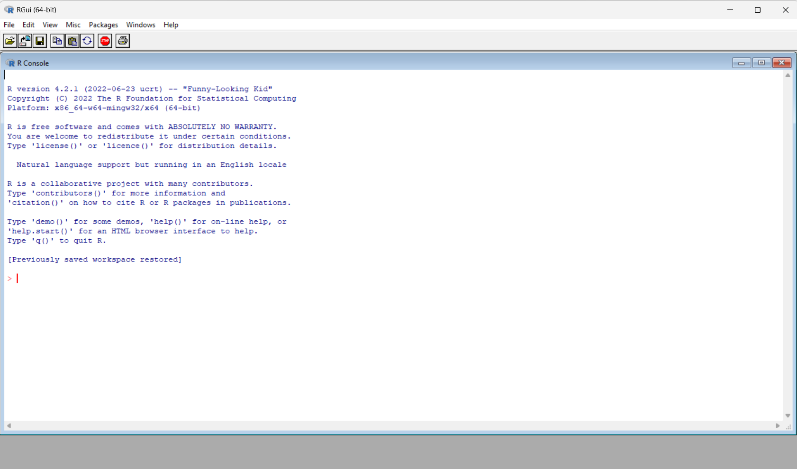
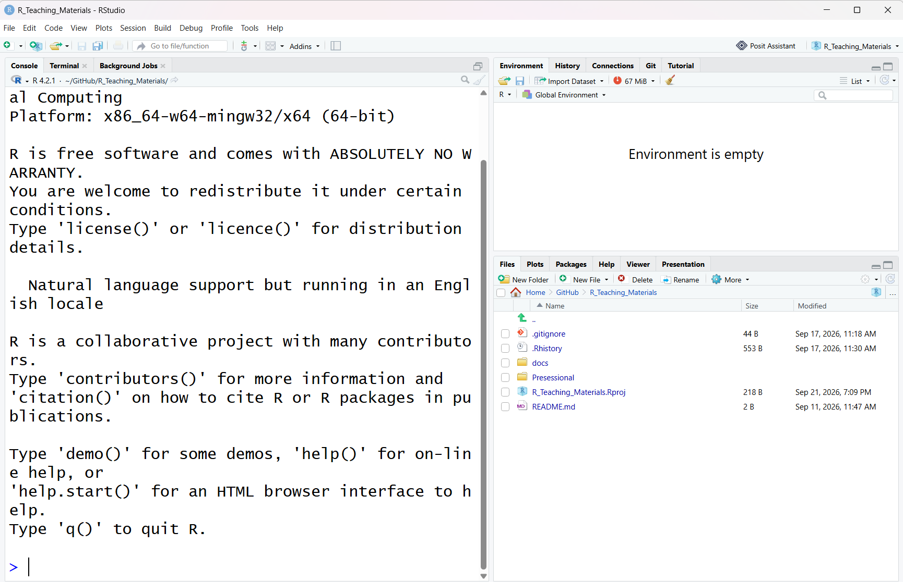
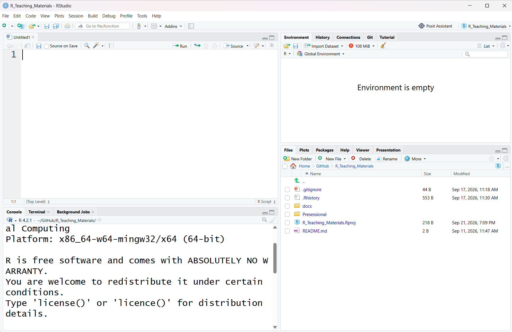
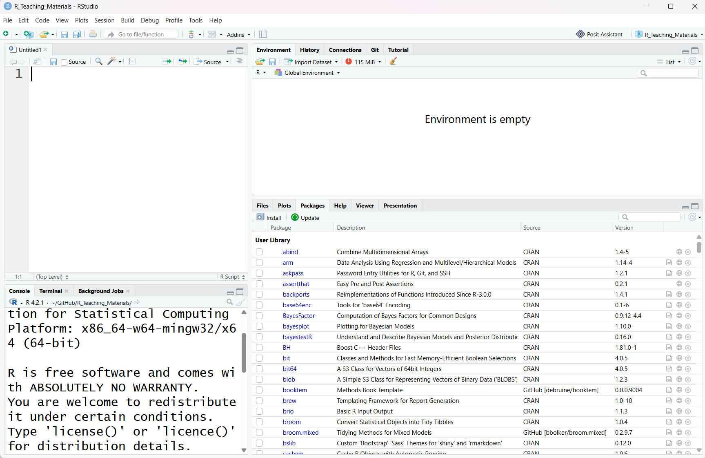
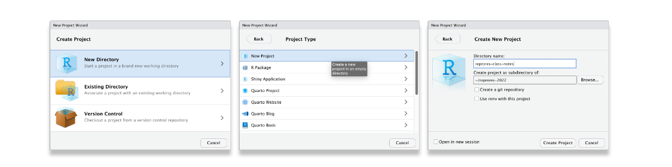
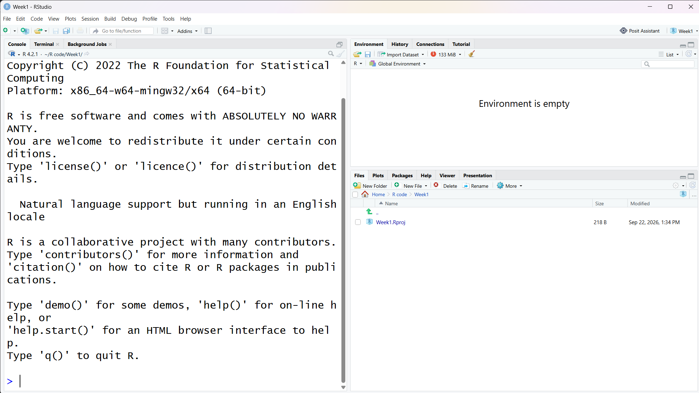
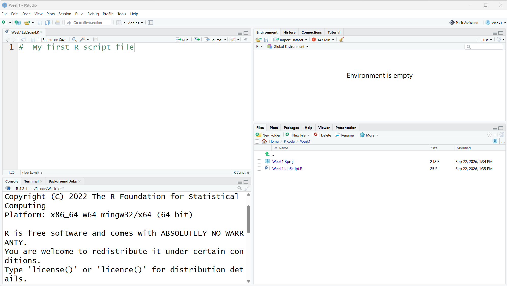

::: {.callout-note appearance="simple"}
## Some general notes about the weekly labs

*We recommend that if you have your own laptop, that you install RStudio on that machine and bring it to the labs each week to work on. If you are unable to do this, you will need to access RStudio via the Department server,or via Posit Cloud.*

*Each lab will have an associated worksheet in a similar format to this. You should go through the worksheet during the lab and try to complete as much of it during the lab as you can. You can work on the sheet individually or in small groups during the lab. Try to answer the lab worksheet questions in your own words however. If you are unable to finish the worksheet during the class, try to finish it outside class time. Model answers will be available on the VLE page from Fridays after the labs so you can check your own answers. If you have any queries during the class, please feel free to ask your lab tutors. If your question relates specifically to the lecture content or the homework sheets, please contact Peter Holland by email or use the forum on the VLE page.*
:::

Learning Outcomes: \ 

1 - Access RStudio \ 

2 - Setting up a new project in RStudio \ 

3 - Creating and saving a new R script \ 

4 - Importing a dataset into R \ 

5 - Perform a basic examination of the dataset \ 

6 - Perform basic data wrangling  \ 

7 - Create a simple visualisation \ 


## Section A. Installing R and RStudio

In this module, we will be using the R programming language to process data, run our statistical analyses, and produce our output. We will use RStudio as the software environment to run R. RStudio packages together a number of tools and features to help make working with R easier and more productive. RStudio is developed by a company called Posit: <https://posit.co/>

You can find a full guide to accessing RStudio as part of the pre-sessional materials here:

[Tutorial 1](Pre_sessional_0.qmd)

The instructions in this worksheet contain a condensed version of those materials.

The recommended methods are: \ 

1 - To download RStudio to your laptop \ 

2 - Use RStudio Desktop on the lab computers \ 

3 - Use the departmental RStudio server:
  <https://psy909.gold.ac.uk/rstudioserver/> \ 
  
  Login with your full university email address   (aaa001\@campus.goldsmiths.ac.uk and standard   password).


The functionality of R and RStudio should be largely the same, regardless of whether you install your own version or access RStudio remotely, and regardless of your operating system. Please bear in mind, though, that there might be minor differences in appearance and functionality dependent on these factors. The lab worksheets have been put together using the latest PC desktop version of RStudio; you may find that some of the packages used in the lab worksheets operate differently when using remote access versions of RStudio.

## Section B. Getting to know RStudio

R is a programming environment for data processing and statistical analysis. On its own, installing R will simply provide you with a very basic looking console, shown below, where you can type in syntax to ask R to input data, run analyses, and produce output.

{#fig-r-console fig-alt="The basic R console"}


*Figure 1: The R console*

Screenshot of the basic R console (original width approx. 6.3 in).
:::

RStudio is an Integrated Development Environment (IDE) for the R programming language. Essentially, it packages together the R console with a host of other useful features to help make working with R easier and more productive. These other features include a text editor, file management, plotting tools, and publishing systems, amongst many other things. For someone new to R (or at any level of R knowledge), using RStudio is more effective than simply using the R console on its own. Whenever you want to use R in this module, please open the RStudio icon, not the R icon!

When you open RStudio (either using the desktop or server version), you should see something like the screenshot below. By default, RStudio will open with three panes. The left pane is simply the R console that we saw above when we open R directly. On the upper right pane, we have the environment tab, and several other tabs that display our history and help with importing data. On the lower right pane, we have several important tabs that help with file management, plotting, and the use of packages. You don't need to know all of the functions of these various tabs straight away, we will introduce these over the next few weeks.

{#fig-rstudio-interface fig-alt="The default three-pane RStudio interface"}


*Figure 2: The RStudio interface*

Screenshot of the default three-pane RStudio layout (original width approx. 6.8 in).
:::

There is another important pane that we would normally also have open. If you click the icon in the upper left with the green + sign just below the file menu, and then click on the first option, 'R Script', this will open up an additional pane in the upper left, as shown below.

{#fig-source-pane fig-alt="RStudio with the source pane open"}


*Figure 3: The RStudio interface with source pane*

Screenshot of RStudio with the source pane open (original width approx. 6.3 in).
:::

The upper left pane is the source pane, and this is where we will type and save the code we will use to run our analyses. This pane is effectively a fancy text editor. You can change the location of panes and what tabs are shown under **Preferences \> Pane Layout,** but it is probably best to stick with the default setup at first.

Feel free to spend a bit of time at this point just navigating around the different panes and tabs, and getting a feel for the layout of the program interface.


One of the key reasons for learning R is so that any quantitative data analysis and research you do is reproducible. If your work is reproducible, it means that you (or someone else) can take your data and get the same result you got. This is easier to do with code because you have a written record of everything you did, compared to using point-and-click software where there is no record and you just have to remember what you did.

You should always start with a clear workspace. This also means that you never want to save your workspace when you exit - the only thing you want to save are your scripts (that is, the file in the upper left pane).


## Section C. Using the R Console

Let's start by using the R console directly; this is the pane in the lower left section of RStudio. Normally, we will be doing our coding in the source pane in the upper left and then saving our code as an R script file. The benefit of this is that you can then re-open your code and continue working on it, or re-run it easily, or send it to others to run. We can, though, enter code directly into the R console pane if we wish. This won't be saved, although you can access your history of codes in the upper right pane. You can use the console as a 'sandbox', though, to play around with code and try new things.

One of the basic things that R can do is function as a fancy calculator. Click in the console pane and then type `2 + 2` and press enter. Hopefully, R will then tell you that this is 4! Try some more complex arithmetical expressions and see what happens. You can also ask R to simply print text by including text inside a double quote. Type `"Good morning"` in the console and see what happens.

## Section D. Coding in R and the Environment Tab

One of the aspects of using R that can be a little scary at first is writing code. While the learning curve can be a little steeper at first when compared to using point and click statistical software, ultimately it will provide you with a deeper and more flexible knowledge base. There is also some jargon that goes along with learning how to code, but this will become second nature with practice. Knowing how to code is also a great general skill that will benefit you if you go on to further postgraduate study, or in your careers.

We will start with some basic concepts and then further develop these over the next few weeks. For the moment, we will continue working directly in the R console in the lower left pane. An important concept in coding with R is the use of objects (or what we can also call variables). Objects store the result of computations that we can then further use. There are some basic rules for how we name objects in R. An object in R:

- contains only letters, numbers, full stops, and underscores

- starts with a letter or a full stop and a letter

- distinguishes uppercase and lowercase letters

For example, we could name an object `mydata`, or `X1`, or `y2` etc. Note that R would interpret `mydata` as being different from `MyData`.

Once we have named an object, we need to assign something to it. We do that by using the `<-` symbol; this is usually referred to as the assignment operator symbol. You can think of this as being equivalent to using the `=` symbol. We start the line of code by having the object name on the left, then `<-`, and then the value we would like to assign to the object. A basic object might look like this:

```{r}
x <- 5
```

R now stores the value of 5 in an object called `x`. Try typing or copying that object into the R console. The console display won't do anything at this point, but in the upper right pane in the environment tab, it should now show you that you have an object called `x` with a value of 5 in the R environment. Now that the value is stored, we can do further things with it.

**Type `x * 2` into the console. What answer do you get?**

::: {.callout-tip collapse="true" title="Show answer"}
**10**
:::

We can extend the use of objects by not just assigning numbers, but assigning more complex calculations. Type the following into the console:

```{r}
myvariable <- 5 * 6 - 2
```

**What do you now see in the environment tab in the upper right pane?**
<textarea rows="2" cols="60" placeholder="Type your answer here..."></textarea>

::: {.callout-tip collapse="true" title="Show answer"}
**28**
:::

We can then create further objects that involve computations with the objects we have already calculated. Type the following into the console:

```{r}
calculation <- myvariable - x
```

If you want to print the value of your object, you can just type `print(calculation)` in the console. You can also see the value in the environment tab.

**What is the value of the `calculation` object?**
<textarea rows="2" cols="60" placeholder="Type your answer here..."></textarea>

::: {.callout-tip collapse="true" title="Show answer"}
**23**
:::

If you want to remove an object from the environment, you can simply type `rm(calculation)` into the console. If you want to remove all objects from the environment, you can use the broom icon at the top of the environment tab.

## Section E. R Packages

On its own, R is capable of performing many functions and statistical analyses; this is often referred to as base R. R really comes alive, though, with the use of packages. Packages provide sets of functions that are like add-ons for base R. Given that the R language is open source, anyone can write and contribute an R package. Packages are used across many different areas of science to extend base R and provide cutting edge functionality for R. Lastly, packages are sometimes arranged into collections that have a coherent purpose or functionality. A good example of the latter is the tidyverse. We will use the tidyverse in upcoming labs. You can read more about the tidyverse here: <https://www.tidyverse.org/>

To use a package in R, we first need to install it, and then we need to load it. You can think of this process as being similar to when you purchase a new smartphone. On its own, base Android can do some useful things, like make phone calls and send texts, but we can get much more out of a smartphone when we add third party apps to it. To use an app on a phone, we first need to download and install it, and then load it by clicking its icon. Packages in R work in a similar way. 

RStudio has a useful interface that makes installing and loading packages quite straightforward. If you look at the lower right pane of RStudio, you will see a tab called packages. Click on that tab, and you should then see a list of packages you have currently installed in R, along with a brief description of each. If you have a new installation of R/RStudio, these will likely be default packages that are included in R (notice that one of them will be called base).

The department RStudio server already has many of the packages we need installed. However, if you are working on your own machine, with a fresh installation of RStudio you may need to download them.

Although we can also use this interface to load packages, we want to produce reproducible code that does not rely on the user pointing and clicking to achieve things. Instead the code should do everything we need so we can share it. Therefore it is best practice to load all of the necessary packages for that analysis at the top of your R script using  `library(package name)`.


{#fig-packages-tab fig-alt="The Packages tab in RStudio"}


*Figure 5: The packages tab*

Screenshot of the Packages tab in the lower right pane (original width approx. 6.3 in).
:::


## Section F. Setting Up a File Structure

Before we learn how to import data into RStudio, we need to setup a file structure to save the work we will complete in these labs, plus any other analyses or projects you might undertake. R uses the concept of a working directory to find and work with files. Start by creating a master folder on your computer that will ultimately contain all of the different projects you will work on. 

- If you are working on the Desktop version of R Studio it is best to create this on your hard drive, rather than directly on a cloud service, as sometimes these cloud services can alter some of the filenames of hidden files that R needs to work properly. 
- If you are working from RStudio on the Department Server, you have been allocated space to save your folder structure in the Home directory. 

You could call this folder MyProjects, or RProjects, or something similar. It is best to avoid special characters, blank spaces and any other unusual folder names. R tends to like folders and files that have short and simple names.

Once you have created this folder, you can go into RStudio, select Tools - Global Options from the menu at the top. Once there, on the general tab, under Default working directory (when not in a project): you then browse to the folder that you just setup. This just tells RStudio to save anything you create to this working directory.

## Section G. Working with projects in RStudio

Now that we have a default working directory, we will introduce working with projects. The idea is that inside the master folder you just created, you will create new folders for any new project you work on. For example, you might have a separate folder for labweek2, labweek3, etc. 

Having separate folders for each project (or lab) you work on, avoids any conflicts within R about where your data or scripts sit, and it will also help you navigate around your projects easily when you need to find things again.

RStudio uses projects to help you organise the files you will need for any analysis you undertake. RStudio projects will group your data files, script files and any output files you produce together in one folder. You can save projects, and then easily re-open them again in a new session, so you can pickup quickly from where you left off. When you create a new project, RStudio will create a new file with an extension Rproj. When you want to start work again on this project in the future, you can simply double click the project filename, and it should open RStudio with that project loaded. 

Let's start a new project for this lab class. Click the File menu in the top left, and then New Project. This will open up the dialog box shown below on the left (Figure 1). Click New Directory, and then New Project. In the Create New Project box on the right below, you can name your new project. Create the new project as a subdirectory of the master folder you created in Section F above.  




Once you have done this, go back to the main interface for RStudio, and have a look at the Files tab in the lower right pane. You should see an .Rproj file in the directory you just created. In my screenshot below, in the Files tab, you can see I have created an R project called **Week1**, with the Rproj file visible. It is sitting in my master directory called **R Code**. In the Files tab, you can navigate around the various folders you have on your computer. In the menu items at the top of the Files tab, you can create new folders, delete and rename folders etc, in much the same way you can when you open up folders on your harddrive.




## Section H. Working with script files in RStudio

At this point, you should also open a new R script file, which will open up the upper left pane. You should now have the standard four panes visible in your RStudio interface. Earlier in section **C** we were entering our syntax directly in the R console in the lower left pane. This is fine if you are practising syntax, or trying out new ideas, but remember that this syntax will not be saved directly when you exit RStudio.

When we run analyses in a project, we would normally want to save the syntax we create, so when we open the project again, we don't need to recreate the syntax from scratch. We can simply open and run the script we have saved, and we will be able to recreate any output we produced on the last occasion. 

An R script file is really just a text file that has the code that tells R what we want to do. You can open up a saved script file in RStudio, but you can also just open it with a normal text editor like Notepad (or the Mac equivalent) and it will show you the same thing. Using the script file in RStudio does have some advantages though; RStudio will use colour coding, auto-complete, and auto-suggestions, amongst other things, to help make your coding faster and simpler. In your new script file, on the first line type the following:
`#  My first R script file`

In the screenshot below (Figure 3), you can see what this should look like. You will see that each line in the script file is numbered. The # symbol at the start of a line tells R to ignore anything further on that line. So why would we use that symbol? We use it to create **comments** in the script file to help ourselves, or others, understand what we are trying to do with the code. It is really important to use comments in the code to help you remember what the purpose of the file and code was all about. It only takes a few seconds to create a comment line, but it could potentially save you hours of pain and frustration in the future if you have to open up a script file after a few years and try to work out what you did if there are no comments there (I know this from experience)! 

Now that we have a line in our script file, we should save it. You will see in the upper left tab that the file is currently untitled, and there is an asterisk. This means the script file is not currently saved. Click on the disk icon at the top of the script pane, or go to File menu, then save, and it should open up a save file dialog box. Name your script file with something like Week1LabScript; you should save this file in the same folder directory you just created above. 

Script files have an .R file extension. Once you have saved the file, you should notice that this file is now added to the directory shown in the Files tab on the lower left pane. You should regularly save your script files as you work on them to make sure you never lose your work. You can see this in the screenshot in Figure 3.





## Section I. Importing Data

To do anything useful with RStudio, we need to have some data to work with! To do that, we need to import data into R. There are various ways we can import data into R, depending on where we are trying to import the data from, and the file format of the data we are trying to import. Generally, we want to deal with files that are in csv file format. A csv file is a plain text file format where the data is separated by commas. The reason for this preference is that csv files can be opened by R and any other spreadsheet software, like Excel, Google docs etc, so it is a flexible file format. 

The data we are going to work with today comes from the World Happiness Report (WHR) of 2023, which derives from Gallup World Poll data. You can find more information about the source of this data here <https://worldhappiness.report/>.

The data from this survey is freely available from a website called Kaggle (<https://www.kaggle.com/>). Kaggle is a data science website that hosts freely available datasets, code for R and Python, and hosts data science competitions, amongst other things. In particular, you can use the search engine on the site here to find open datasets on virtually any topic you can imagine: <https://www.kaggle.com/datasets>. 

You can import data into R directly from sources on the WWW (you can see examples of this in the presessional materials), but to keep things simple for today, we will first download this data as a .csv file and move it across to the folder for Week1 that we created above. 
