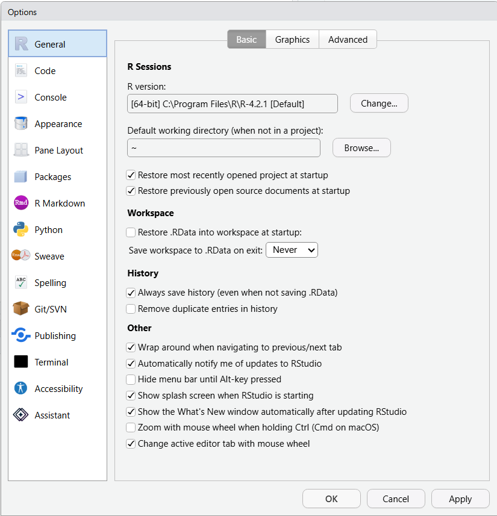
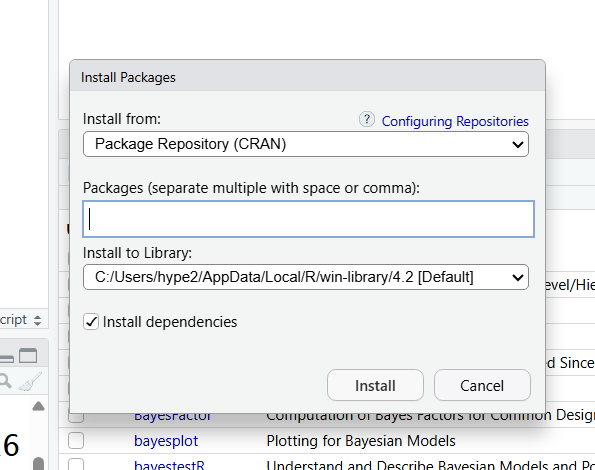
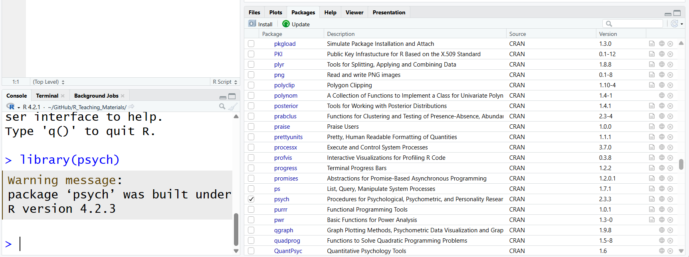

```{=html}
<!--
FIGURE PLACEHOLDERS
Each figure below is a grey placeholder box. To add a figure, delete the
placeholder block (the ::: {.figure-placeholder} ... ::: div) and uncomment
the image line that sits directly above it, editing the file path as needed.

MODEL ANSWERS
Answers are hidden in collapsed callouts (click "Show answer" to reveal).
Only works in HTML output.
-->
```

::: {.callout-note appearance="simple"}
## Some general notes about the weekly labs

*We recommend that if you have your own laptop, that you install RStudio on that machine and bring it to the labs each week to work on. If you are unable to do this, you will need to access RStudio via the Department server,or via Posit Cloud.*

*Each lab will have an associated worksheet in a similar format to this. You should go through the worksheet during the lab and try to complete as much of it during the lab as you can. You can work on the sheet individually or in small groups during the lab. Try to answer the lab worksheet questions in your own words however. If you are unable to finish the worksheet during the class, try to finish it outside class time. Model answers will be available on the VLE page from Fridays after the labs so you can check your own answers. If you have any queries during the class, please feel free to ask your lab tutors. If your question relates specifically to the lecture content or the homework sheets, please contact Peter Holland by email or use the forum on the VLE page.*
:::

## Section A. Installing R and RStudio

In this module, we will be using the R programming language to process data, run our statistical analyses, and produce our output. We will use RStudio as the software environment to run R. RStudio packages together a number of tools and features to help make working with R easier and more productive. RStudio is developed by a company called Posit: <https://posit.co/>

The desktop version of RStudio is free and open source, and can be installed on PC, Mac or Linux. Please note that RStudio will not work very well (or at all) on tablets and phones, you will need to install it on a laptop or desktop to work effectively. You can read more about the basic features of RStudio here: <https://posit.co/products/open-source/rstudio/>

You will notice that Posit develop a number of other products for commercial and enterprise purposes. You will not need to purchase any of these; the work we undertake in the module will be done with the free desktop version.

You can find the installer for RStudio here: <https://posit.co/download/rstudio-desktop/>

Installing RStudio involves a two-step process. You first need to install R itself; if you click the link for R on the page above, it will take you to the Comprehensive R Archive Network (CRAN: <https://cran.rstudio.com/>). Follow the instructions to install the version of R appropriate for your operating system. You might notice that this adds an R icon on your desktop. If you click this icon, it will run the R console directly, but you do not need to do this as we will run R from within RStudio.

Once you have R installed on your machine, return to the link above and install RStudio. The website should detect your operating system and offer you the download link for RStudio that is applicable for your machine. Once the installation process is complete, you should then be ready to click on the RStudio icon and open the program.

There are two alternative ways you can access RStudio if you do not have a laptop you can bring to class. These alternatives involve accessing RStudio remotely and using it via a web browser. This will work on the lab machines for the class, and you can also do this from home if you are unable to install RStudio on your machine. 

The first alternative is to access RStudio remotely via our Departmental server. To log on to the R Studio server go to: <https://psy909.gold.ac.uk/rstudioserver/>

Login with your full university email address (aaa001\@campus.goldsmiths.ac.uk and standard password). You should now see R studio in your web browser. Each user has their own home folder and can create sub folders.

The functionality of R and RStudio should be largely the same, regardless of whether you install your own version or access RStudio remotely, and regardless of your operating system. Please bear in mind, though, that there might be minor differences in appearance and functionality dependent on these factors. The lab worksheets have been put together using the latest PC desktop version of RStudio; you may find that some of the packages used in the lab worksheets operate differently when using remote access versions of RStudio.

The second alternative involves accessing a cloud version of RStudio using Posit Cloud, available here: <https://posit.cloud/>

To use Posit Cloud, you will need to sign up for an account. You can sign up for a free account, which will give you 25 hours of computing time per month with RStudio in the cloud for free. There are paid subscriptions for longer computing time, but the free version should fully cover our lab time.

## Section B. Getting to know RStudio

R is a programming environment for data processing and statistical analysis. If you would like to know a little history on the R language, you can refer to its Wikipedia entry here: <https://en.wikipedia.org/wiki/R_(programming_language)>

On its own, installing R will simply provide you with a very basic looking console, shown below, where you can type in syntax to ask R to input data, run analyses, and produce output.

{#fig-r-console fig-alt="The basic R console"}


*Figure 1: The R console*

Screenshot of the basic R console (original width approx. 6.3 in).
:::

RStudio is an Integrated Development Environment (IDE) for the R programming language. Essentially, it packages together the R console with a host of other useful features to help make working with R easier and more productive. These other features include a text editor, file management, plotting tools, and publishing systems, amongst many other things. For someone new to R (or at any level of R knowledge), using RStudio is more effective than simply using the R console on its own. Whenever you want to use R in this module, please open the RStudio icon, not the R icon!

Start by double clicking on the RStudio icon. When you first open the program, you should see something like the screenshot below. By default, RStudio will open with three panes. The left pane is simply the R console that we saw above when we open R directly. On the upper right pane, we have the environment tab, and several other tabs that display our history and help with importing data. On the lower right pane, we have several important tabs that help with file management, plotting, and the use of packages. You don't need to know all of the functions of these various tabs straight away, we will introduce these over the next few weeks.

{#fig-rstudio-interface fig-alt="The default three-pane RStudio interface"}


*Figure 2: The RStudio interface*

Screenshot of the default three-pane RStudio layout (original width approx. 6.8 in).
:::

There is another important pane that we would normally also have open. If you click the icon in the upper left with the green + sign just below the file menu, and then click on the first option, 'R Script', this will open up an additional pane in the upper left, as shown below.

{#fig-source-pane fig-alt="RStudio with the source pane open"}


*Figure 3: The RStudio interface with source pane*

Screenshot of RStudio with the source pane open (original width approx. 6.3 in).
:::

The upper left pane is the source pane, and this is where we will type and save the code we will use to run our analyses. This pane is effectively a fancy text editor. You can change the location of panes and what tabs are shown under **Preferences \> Pane Layout,** but it is probably best to stick with the default setup at first.

Feel free to spend a bit of time at this point just navigating around the different panes and tabs, and getting a feel for the layout of the program interface.

## Section C. Configuring RStudio

::: {.callout-important appearance="simple"}
**NB. This section is more relevant for those using RStudio on their own machine; you may have limited configuration options if you are using the cloud version, or a desktop version on the lab computers. You can try these later at home if you cannot do so in the lab class. Also, the configuration options you can see may vary slightly depending on which version of RStudio you are using, and your operating system.**
:::

Before we look more closely at the functionality of RStudio, there are some configuration options for the program you might want to consider. Click on **Global Options...** under the **Tools** menu at the top of the screen. This will open up a menu with a set of configuration options, shown below. You don't need to worry about most of the settings here to start with, but there are a few useful changes to make. Firstly, if you click on the appearance tab, you can make changes to the visual look of the program, including colours, fonts, etc. The accessibility tab at the bottom has other visual changes you can make if that is necessary for you.

{#fig-global-options fig-alt="The Global Options dialog box"}


*Figure 4: Configuring RStudio*

Screenshot of the Global Options dialog (original width approx. 6.3 in).
:::

One of the key reasons for learning R is so that any quantitative data analysis and research you do is reproducible. If your work is reproducible, it means that you (or someone else) can take your data and get the same result you got. This is easier to do with code because you have a written record of everything you did, compared to using point-and-click software where there is no record and you just have to remember what you did.

To help ensure your work is reproducible, there are a few settings you should change in RStudio. If you keep stuff around in your workspace, things can get messy and you can accidentally end up using the wrong dataset or object. You should always start with a clear workspace. This also means that you never want to save your workspace when you exit - the only thing you want to save are your scripts (that is, the file in the upper left pane).

- Go to **Tools \> Global Options**

- In the General tab, uncheck the box that says **Restore .RData into workspace at startup**.

- Additionally, set the **"Save workspace to .RData on exit"** to **Never.**


Screenshot of the General options tab showing the workspace settings (original width approx. 4.5 in; alt text: "RStudio settings").
:::

I would also recommend unticking the **'Restore most recently opened project at startup'** and the **'Restore previously open source documents at startup'** options. It is generally best to open R with a clean slate.

## Section D. Using the R Console

Let's start by using the R console directly; this is the pane in the lower left section of RStudio. Normally, we will be doing our coding in the source pane in the upper left and then saving our code as an R script file. The benefit of this is that you can then re-open your code and continue working on it, or re-run it easily, or send it to others to run. We can, though, enter code directly into the R console pane if we wish. This won't be saved, although you can access your history of codes in the upper right pane. You can use the console as a 'sandbox', though, to play around with code and try new things.

One of the basic things that R can do is function as a fancy calculator. Click in the console pane and then type `2 + 2` and press enter. Hopefully, R will then tell you that this is 4! Try some more complex arithmetical expressions and see what happens. You can also ask R to simply print text by including text inside a double quote. Type `"Good morning"` in the console and see what happens.

## Section E. Coding in R and the Environment Tab

One of the aspects of using R that can be a little scary at first is writing code. While the learning curve can be a little steeper at first when compared to using point and click statistical software, ultimately it will provide you with a deeper and more flexible knowledge base. There is also some jargon that goes along with learning how to code, but this will become second nature with practice. Knowing how to code is also a great general skill that will benefit you if you go on to further postgraduate study, or in your careers.

We will start with some basic concepts and then further develop these over the next few weeks. For the moment, we will continue working directly in the R console in the lower left pane. An important concept in coding with R is the use of objects (or what we can also call variables). Objects store the result of computations that we can then further use. There are some basic rules for how we name objects in R. An object in R:

- contains only letters, numbers, full stops, and underscores

- starts with a letter or a full stop and a letter

- distinguishes uppercase and lowercase letters

For example, we could name an object `mydata`, or `X1`, or `y2` etc. Note that R would interpret `mydata` as being different from `MyData`.

Once we have named an object, we need to assign something to it. We do that by using the `<-` symbol; this is usually referred to as the assignment operator symbol. You can think of this as being equivalent to using the `=` symbol. We start the line of code by having the object name on the left, then `<-`, and then the value we would like to assign to the object. A basic object might look like this:

```{r}
x <- 5
```

R now stores the value of 5 in an object called `x`. Try typing or copying that object into the R console. The console display won't do anything at this point, but in the upper right pane in the environment tab, it should now show you that you have an object called `x` with a value of 5 in the R environment. Now that the value is stored, we can do further things with it.

**Type `x * 2` into the console. What answer do you get?**

::: {.callout-tip collapse="true" title="Show answer"}
**10**
:::

We can extend the use of objects by not just assigning numbers, but assigning more complex calculations. Type the following into the console:

```{r}
myvariable <- 5 * 6 - 2
```

**What do you now see in the environment tab in the upper right pane?**
<textarea rows="2" cols="60" placeholder="Type your answer here..."></textarea>

::: {.callout-tip collapse="true" title="Show answer"}
**28**
:::

We can then create further objects that involve computations with the objects we have already calculated. Type the following into the console:

```{r}
calculation <- myvariable - x
```

If you want to print the value of your object, you can just type `print(calculation)` in the console. You can also see the value in the environment tab.

**What is the value of the `calculation` object?**
<textarea rows="2" cols="60" placeholder="Type your answer here..."></textarea>

::: {.callout-tip collapse="true" title="Show answer"}
**23**
:::

If you want to remove an object from the environment, you can simply type `rm(calculation)` into the console. If you want to remove all objects from the environment, you can use the broom icon at the top of the environment tab.

## Section F. R Packages

On its own, R is capable of performing many functions and statistical analyses; this is often referred to as base R. R really comes alive, though, with the use of packages. Packages provide sets of functions that are like add-ons for base R. Given that the R language is open source, anyone can write and contribute an R package. Packages are used across many different areas of science to extend base R and provide cutting edge functionality for R. There are literally thousands of R packages that are freely available to use, and we will use a variety of packages in R across this module. Many of the packages reside on the Comprehensive R Archive Network (CRAN): <https://cran.r-project.org/index.html>

Spend some time having a look around this website. CRAN have helpfully arranged many packages into task views; these collate useful packages by specific scientific areas. You can see these views here: <https://cran.r-project.org/web/views/>

There are also many R packages that do not reside on CRAN, but are nonetheless useful. Lastly, packages are sometimes arranged into collections that have a coherent purpose or functionality. A good example of the latter is the tidyverse. We will use the tidyverse in upcoming labs. You can read more about the tidyverse here: <https://www.tidyverse.org/>

To use a package in R, we first need to install it, and then we need to load it. You can think of this process as being similar to when you purchase a new smartphone. On its own, base Android can do some useful things, like make phone calls and send texts, but we can get much more out of a smartphone when we add third party apps to it. To use an app on a phone, we first need to download and install it, and then load it by clicking its icon. Packages in R work in a similar way. First, we need to download and install them, and then when we want to use them, we need to tell R to load the package. An important point is that we only need to install the package once, but we need to load it whenever we want to use it (just like a phone app).

RStudio has a useful interface that makes installing and loading packages quite straightforward. If you look at the lower right pane of RStudio, you will see a tab called packages. Click on that tab, and you should then see a list of packages you have currently installed in R, along with a brief description of each. If you have a new installation of R/RStudio, these will likely be default packages that are included in R (notice that one of them will be called base).

{#fig-packages-tab fig-alt="The Packages tab in RStudio"}


*Figure 5: The packages tab*

Screenshot of the Packages tab in the lower right pane (original width approx. 6.3 in).
:::

If you want to install a new package, click on the install button on this tab. This will open up a dialog box where you can search for the package you would like to install. You will notice a tick box that says 'install dependencies'. Leave this ticked. Many packages are dependent on other packages to run properly, so often when you install a package, it will also install the other packages that your target package needs. As an alternative, you can type `install.packages("name of package")` into the console. Once installed, it will join the list of packages you can see in the packages tab in RStudio.

{#fig-installing-packages fig-alt="The Install Packages dialog box" width="5.1in"}


*Figure 6: Installing packages*

Screenshot of the Install Packages dialog box (original width approx. 5.1 in).
:::

Once installed, you can then use that package in R whenever you like. You do, though, need to load the package whenever you want to use it in a session; if you close RStudio, for example, you would need to re-load it to use it again. To load a package in RStudio is very simple; just click the checkbox next to the package you would like to load. Alternatively, you can type `library(name of package)` in the console window. In the screenshot below, I have loaded a package called psych. Notice in the console window, it now displays the library command showing the package has been loaded. We will use the psych package later in the term. You can read more about the package here: <http://personality-project.org/r/psych/>

{#fig-loading-packages fig-alt="RStudio after loading the psych package"} -->


*Figure 7: Loading packages*

Screenshot of RStudio after loading the psych package, with the library command visible in the console (original width approx. 6.7 in).
:::

Packages will normally be updated by their developer at various stages. You can install updates to the packages by clicking the update button in the packages tab in RStudio. Note above too, that by default the base r package and several other core R packages will be loaded when you start RStudio, so you do not need to load those packages each time.

If you are working on your own machine, try installing and loading the `psych` package and the `tidyverse` collection of packages.


